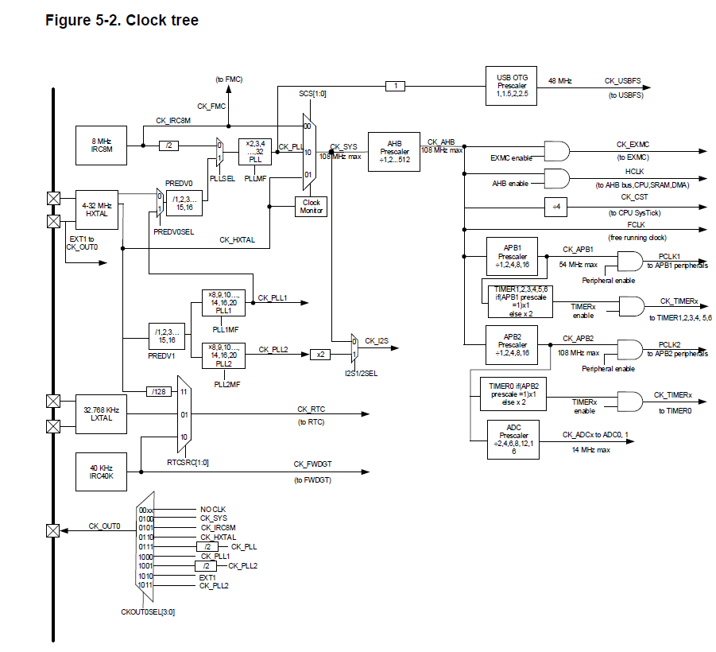
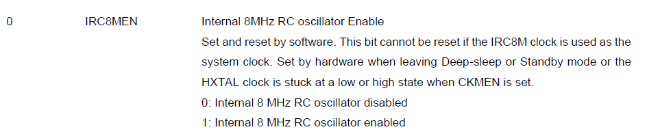

## Clock Tree    

The GD32VF103 can choose serveral clock sources:
- A 8M internal RC oscillator,The default clock source when the CPU is powered up.
- A High Speed crystal oscillator.
- A 40K Low speed internal RC oscillator to RTC/Internal Watchdog.
- A Low speed external crystal oscillator to RTC.

> I was going to try to disable 8M internal RC oscillator .When checking the register ,I find that it is not allowed to disable a clock  when a clock is used as system clock.
> 

[TBD]