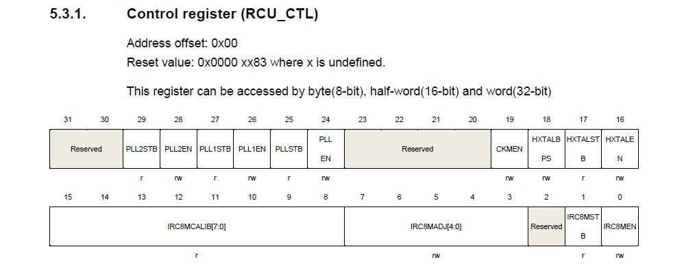

# Clock    

    
The GD32VF103 can choose serveral clock sources:
- A 8M internal RC oscillator,The default clock source when the CPU is powered up.
- A High Speed crystal oscillator.
- A 40K Low speed internal RC oscillator to RTC/Internal Watchdog.
- A Low speed external crystal oscillator to RTC.

> I was going to try to disable 8M internal RC oscillator at the begining of the power on .When checking the register ,I find that it is not allowed to disable a clock  when the clock is used as system clock.After testing ,That's true.
> 

According the Clock tree :
- The source of PLL1 and PLL2 is HXTAL
- CK_PLL1 can only be used as the CK_OUT if it is not used as the clock source of PLL
- CK_PLL2 can only be used as the CK_OUT if it is not used as the clock source of CK_I2S

The Iar evaluation board is embed with a 25Mhz crystal oscillator .To reach the maximum system clock ,the configuration can be:   
> __108MHz = (25MHz/(PREDV1=5MHz)/(PREDV0=5MHz))\*(PLL1MF=12)*(PLLMF=9)__     

  Or:    
> __108MHz = (25MHz/(PREDV1=5MHz)/(PREDV0=10MHz))\*（PLL1MF=8）*（PLLMF=27）__

About experiment:   
1. When the halt/breakpoint , the CK_OUT will not stop
>
2. When configured to reset with hardware , IAR is  implemented likely with software reset rather than hard reset.That can lead to confusion.
After MCU rested  , the reset value of RCU_CTL should be __0x0000 xx83__ ,take it as a example .
>
But after the experiment ,I found that the register is not recovered. 
 